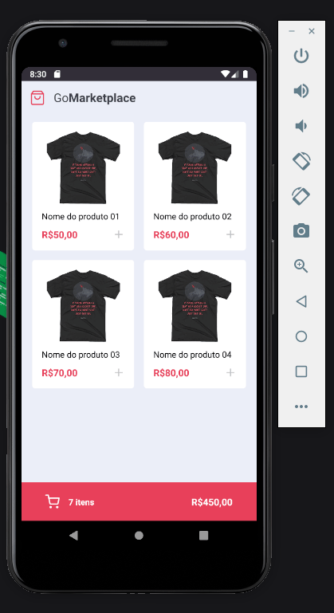

# Alfiado Constantino
<h1 align="center">
   
  GoMarketPlace App Mobile
</h1>

Aplicação de produtos

  

## Descrição
Neste desafio, desenvolvi uma aplicação em React-Native para  listar produtos, adicionar ao carrinho, aumentar quantidade e diminuir.
 
Aprendendo fundamentos do react-native usando typescript, styled-components para estilos na nossa aplicação, contextApi, hooks e muito mais.

## Recursos Usados

- TypeScript
- React-Native
- Json Server

## Para rodar o projecto!
para rodar o projecto primeiro deve clonar o repositório e abrir a pasta no terminal e rodar os seguintes comandos: 
1. Clone o arquivo no seu terminal `https://github.com/alfiadoDev/desafio-fundamentos-react-native`.
2. ainda no terminal digite o comando `cd desafio-fundamentos-react-native` para entrar na pasta do projecto.
3. execute o comando `yarn` no terminal para instalar todas as dependências do projecto.

### Para Android
- abra o seu emulador;
- voltando a linha de comandos execute `yarn android`. isto pode levar um tempo. depois abra um outro terminal com o mesmo caminho/path do projecto e execute `yarn start`, volte ao outro terminal antigo execute novamente `yarn android`

## License

This project is licensed under the MIT License - see the [LICENSE](https://opensource.org/licenses/MIT) page for details.
